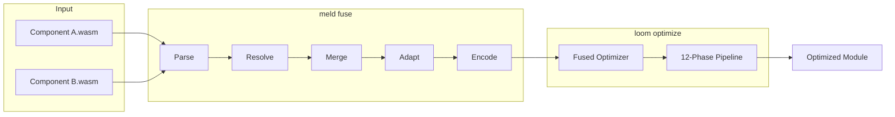
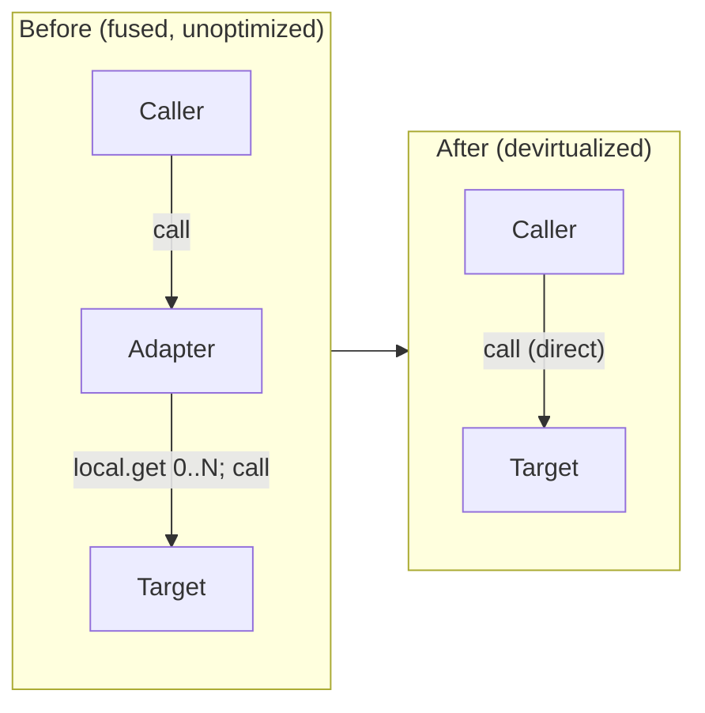
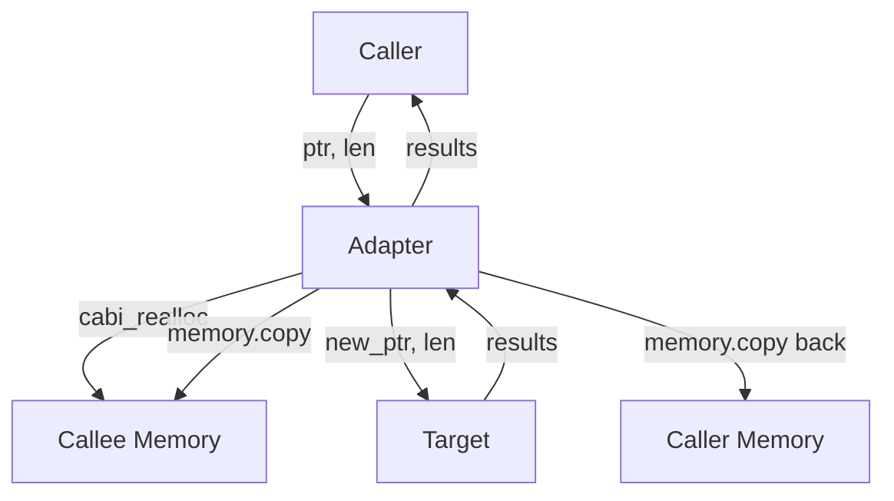
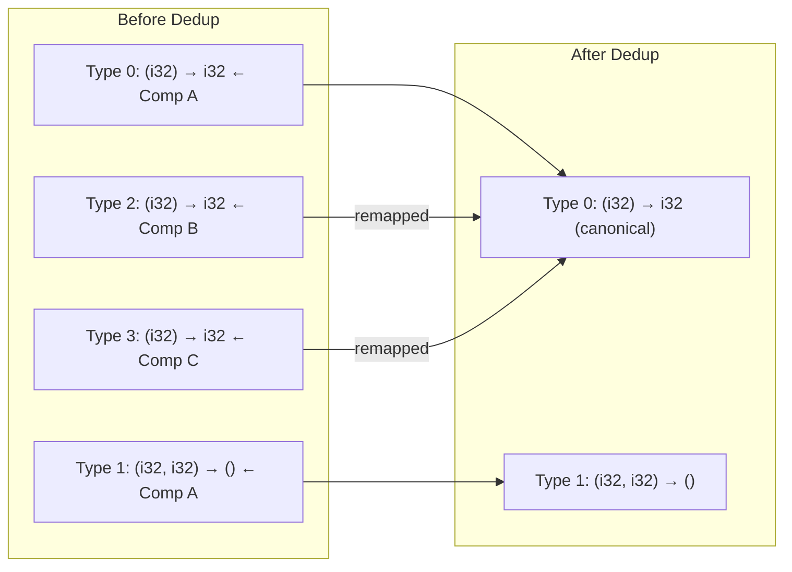
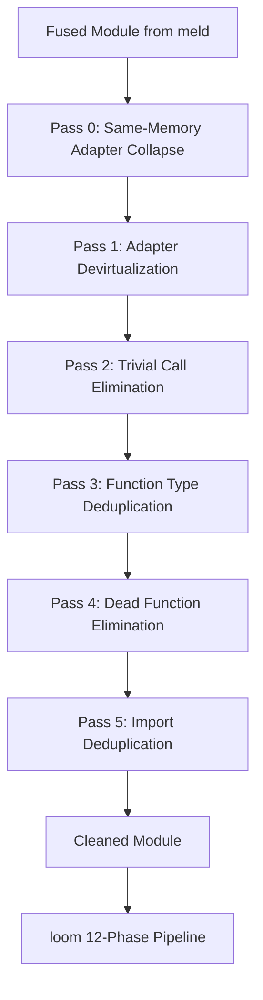
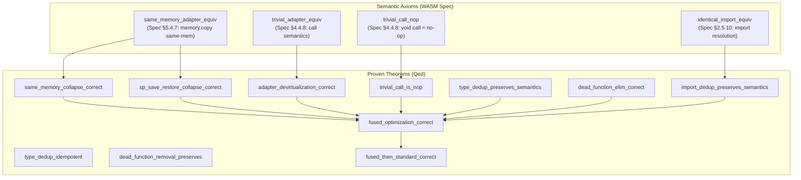
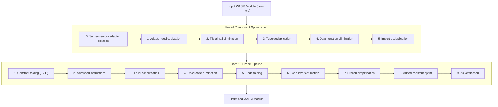
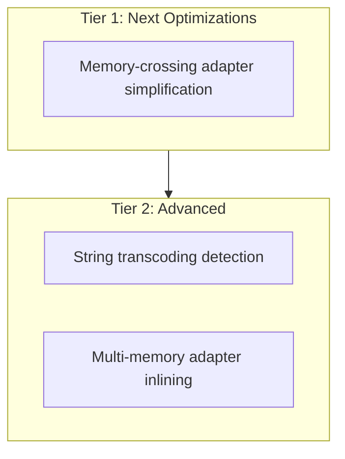

# Fused Component Optimization

Specialized optimization for WebAssembly modules produced by component fusion (e.g., meld).

## Overview

When multiple P2/P3 WebAssembly components are **fused** into a single core module, the result contains characteristic patterns that standard optimization passes miss. The fused component optimizer targets these patterns specifically, achieving additional size and performance improvements beyond what loom's standard 12-phase pipeline provides.

Component fusion (performed by tools like meld) combines multiple components into one module. This process introduces:
- **Same-memory adapters** that redundantly allocate+copy within a single linear memory
- **Adapter trampolines** for cross-component calls
- **Duplicate function types** from each source component
- **Duplicate imports** where multiple components imported the same external function
- **Dead functions** (adapters that can be bypassed)

The fused optimizer detects and eliminates these artifacts.

---

## The meld-loom Pipeline



**meld** handles the structural transformation: resolving dependencies, merging index spaces, generating adapter trampolines, and producing a valid single-module output.

**loom** handles the semantic optimization: devirtualizing adapters, eliminating dead code, folding constants, reducing strength, and verifying correctness.

Together they enable **whole-program optimization across former component boundaries** - something neither tool can achieve alone.

---

## Fusion Artifacts

### Adapter Trampolines

When component A calls a function exported by component B, meld generates an **adapter trampoline**:



For **direct adapters** (shared memory), the adapter is a trivial forwarding function:

```wasm
;; Generated by meld: adapter from component 0 to component 1
(func $adapter (param i32) (result i32)
  local.get 0        ;; Forward parameter
  call $target_func  ;; Call the actual target
)
```

For **memory-crossing adapters** (multi-memory mode), the adapter is more complex:



### Duplicate Function Types

Each source component contributes its own type section. After fusion, the merged type section contains duplicates:



### Duplicate Imports

Multiple components may import the same external function. These are merged and all references remapped.

---

## Optimization Passes



### Pass 0: Same-Memory Adapter Collapse

**What**: Collapse same-memory adapters (realloc + memory.copy within one linear memory) into trivial forwarding trampolines.

**Pattern detected**: Functions in single-memory modules that:
- Have locals (temporary pointers for the copy)
- Contain `memory.copy {0, 0}` (same-memory copy) with no cross-memory copies
- Call `cabi_realloc` at least once
- Call exactly one non-realloc target function
- Have no control flow, memory stores, or unsafe global writes (balanced single-global save/restore such as stack pointer prologue/epilogue is allowed)
- Have the same signature as the target

**Transformation**: Replace the function body with a forwarding trampoline:
```wasm
;; Before: allocate + copy + call target
(func $adapter (param i32 i32) (result i32)
  ... cabi_realloc ... memory.copy 0 0 ... call $target ...)

;; After: trivial forwarding (Pass 1 then devirtualizes)
(func $adapter (param i32 i32) (result i32)
  local.get 0
  local.get 1
  call $target)
```

**Why this is correct**: In a single-memory module, `memory.copy {0, 0}` copies within the same address space. The adapter allocates a buffer, copies argument data to it, then calls the target with the new pointer. Since both pointers reference the same memory, the target can read the data at the original pointer directly. The allocation and copy are semantically redundant.

**Stack pointer save/restore**: Meld-generated adapters for non-trivial types often include a stack pointer prologue/epilogue (`global.get $sp; sub; global.set $sp` ... `global.set $sp` to restore). These balanced single-global writes are safe to collapse because the entire body is replaced by a forwarding trampoline — the global is never modified in the collapsed function (net-zero effect). The predicate `has_unsafe_global_writes` allows this pattern while still rejecting writes to multiple globals or write-only globals.

**Synergy with Pass 1**: After collapse, the adapter is a trivial forwarding trampoline. Pass 1 detects this and rewrites all callers to call the target directly, eliminating both the adapter overhead AND the unnecessary allocation/copy.

### Pass 1: Adapter Devirtualization

**What**: Detect trivial adapter trampolines and rewrite callers to bypass them.

**Pattern detected**:
```wasm
(func $adapter (param p0 p1 ... pN) (result r0 r1 ... rM)
  local.get 0
  local.get 1
  ...
  local.get N
  call $target
)
```

**Transformation**: Replace `call $adapter` with `call $target` at every call site.

**Why this is correct**: The adapter pushes exactly the same arguments onto the stack in the same order and calls the target. It is semantically identical to calling the target directly. No locals are modified, no control flow exists, no side effects occur.

**Handles adapter chains**: If adapter A calls adapter B which calls target T, we resolve transitively: A → T and B → T.

### Pass 2: Trivial Call Elimination

**What**: Detect `() -> ()` functions with empty bodies and remove all calls to them.

**Pattern detected**: Functions generated by meld as `cabi_post_return` stubs that take no parameters, return no results, and contain only `End`/`Nop` instructions.

**Transformation**: Remove every `call $trivial` instruction from all function bodies.

**Why this is correct**: A function with `() -> ()` signature and an empty body is a no-op per the WASM spec. Calling it and not calling it produce identical execution states.

### Pass 3: Function Type Deduplication

**What**: Merge structurally identical function types and remap all references.

**How**: Hash each type by its parameter and result lists. Build a canonical mapping. Update all type references (imports, `call_indirect`).

**Safety**: Skipped when raw type section bytes are present (GC/reference types) since those require complex re-encoding.

### Pass 4: Dead Function Elimination

**What**: Remove functions unreachable from any export root.

**How**: Build a liveness set from export roots and start function. Walk the call graph transitively. Remove unreachable functions and remap indices. Parse element sections with wasmparser to extract indirect call targets rather than conservatively marking all functions as live. Rebuild element sections with remapped indices after removal.

### Pass 5: Import Deduplication

**What**: Merge identical imports (same module + name + type).

**How**: Hash each import by module name, field name, and type index. Build canonical mapping. Remap all function references (imported function indices shift, local function indices shift by the reduction count).

---

## Correctness Proofs

Each transformation has a corresponding formal proof in Rocq (`proofs/simplify/FusedOptimization.v`):

| Theorem | Status | Pass |
|---|---|---|
| `same_memory_collapse_correct` | **Proven** | Pass 0 |
| `sp_save_restore_collapse_correct` | **Proven** | Pass 0 |
| `adapter_devirtualization_correct` | **Proven** | Pass 1 |
| `devirtualization_preserves_module_semantics` | **Proven** | Pass 1 |
| `trivial_call_is_nop` | **Proven** | Pass 2 |
| `trivial_call_elimination_preserves_semantics` | **Proven** | Pass 2 |
| `type_dedup_preserves_semantics` | **Proven** | Pass 3 |
| `type_dedup_idempotent` | **Proven** | Pass 3 |
| `dead_function_elim_correct` | **Proven** | Pass 4 |
| `dead_function_removal_preserves_semantics` | **Proven** | Pass 4 |
| `import_dedup_preserves_semantics` | **Proven** | Pass 5 |
| `fused_optimization_correct` | **Proven** | Combined |
| `fused_then_standard_correct` | **Proven** | Composition |

All 13 theorems are proven (Qed). Zero Admitted proofs remain.

### Proof Architecture

The proofs rely on four well-justified semantic axioms from the WASM spec:



**Adapter Devirtualization** uses a direct equivalence proof:
- The adapter body `local.get 0; ...; local.get N; call T; end` reconstructs the parameter stack and delegates to the target
- Operationally equivalent to calling the target directly

**Type Deduplication** uses structural equality:
- If `params(T_i) = params(T_j)` and `results(T_i) = results(T_j)`, any instruction referencing `T_i` behaves identically when referencing `T_j`

**Dead Function Elimination**: Unreachable code cannot affect observable behavior.

**Import Deduplication**: Same module + name + type resolve to the same external binding per the WebAssembly specification.

---

## Integration with loom Pipeline



**Why before?** Adapter devirtualization creates dead code (unused adapters) and simplifies call graphs, which benefits all subsequent passes. Type and import deduplication reduce index space sizes, improving analysis precision.

---

## Usage

### As Part of the meld-loom Pipeline

```bash
# Step 1: Fuse components with meld
meld fuse component_a.wasm component_b.wasm -o fused.wasm

# Step 2: Optimize fused module with loom
loom optimize fused.wasm -o optimized.wasm
```

loom automatically detects fusion artifacts and applies the fused optimizer.

### Programmatic API

```rust
use loom_core::fused_optimizer::{optimize_fused_module, FusedOptimizationStats};
use loom_core::Module;

let mut module: Module = parse_wasm(&bytes)?;

// Apply fused-specific optimizations first
let stats: FusedOptimizationStats = optimize_fused_module(&mut module)?;
println!("Same-memory adapters collapsed: {}", stats.same_memory_adapters_collapsed);
println!("Adapters devirtualized: {}", stats.calls_devirtualized);
println!("Trivial calls eliminated: {}", stats.trivial_calls_eliminated);
println!("Types deduplicated: {}", stats.types_deduplicated);
println!("Dead functions eliminated: {}", stats.dead_functions_eliminated);
println!("Imports deduplicated: {}", stats.imports_deduplicated);

// Then apply standard loom optimizations
optimize_module(&mut module)?;
```

---

## Roadmap

### Implemented

| Feature | Status | Coverage |
|---|---|---|
| Same-memory adapter collapse | Done | Single-memory modules with realloc+copy adapters |
| Trivial adapter devirtualization | Done | All direct adapters |
| Trivial call elimination | Done | () -> () no-op functions |
| Function type deduplication | Done | Basic types (skips GC) |
| Dead function elimination | Done | With element segment parsing |
| Function import deduplication | Done | Function imports only |
| Correctness proofs | Done | All 12 theorems proven (Qed) |

### Planned



| Feature | Priority | Impact | Effort |
|---|---|---|---|
| Memory-crossing adapter simplification | High | Eliminates entire adapters in shared-memory | High |
| String transcoding detection | Low | Rare but high savings when hit | Very High |
| Multi-memory adapter inlining | Low | Reduces trampoline overhead in multi-memory mode | High |

---

## Architecture Decision Log

### Why Devirtualize at the Module Level?

**Decision**: Detect and eliminate adapter patterns in loom rather than in meld.

**Rationale**: Meld must generate adapters for correctness (they handle Canonical ABI boundary crossing). Only after fusion is complete can we determine which adapters are trivial and can be bypassed. loom, as the optimizer, is the natural place for this analysis.

### Element Segment Parsing for DCE

**Decision**: Parse element sections to extract indirect call targets instead of conservatively marking all functions as live.

**Rationale**: Element segments populate indirect call tables (`call_indirect`). By parsing element sections with wasmparser, we extract the exact function references (both `ElementItems::Functions` and `ref.func` in `ElementItems::Expressions`). Only those functions are marked as potentially callable via indirect calls. After DCE removes dead functions, element sections are rebuilt with remapped indices using `wasm_encoder::ElementSection`. Falls back to conservative behavior for unsupported element kinds.

### Why Import Deduplication Before the Standard Pipeline?

**Decision**: Run import deduplication early to normalize the index space.

**Rationale**: Every import affects all function indices (local functions are numbered after imports). Removing duplicate imports shifts indices, which is cleaner to do once before the standard pipeline runs multiple analysis passes.

### Why Only Function Import Deduplication?

**Decision**: Only deduplicate function imports, not memory/table/global imports.

**Rationale**: Memory, table, and global imports have richer semantics (mutability, limits, element types). Deduplicating them requires deeper analysis to verify they are truly identical. Function imports are the most common duplicates after fusion and are safe to merge when module+name+type match.
